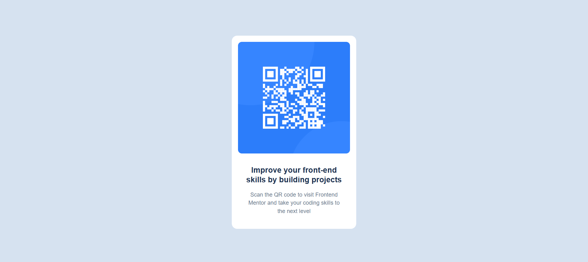
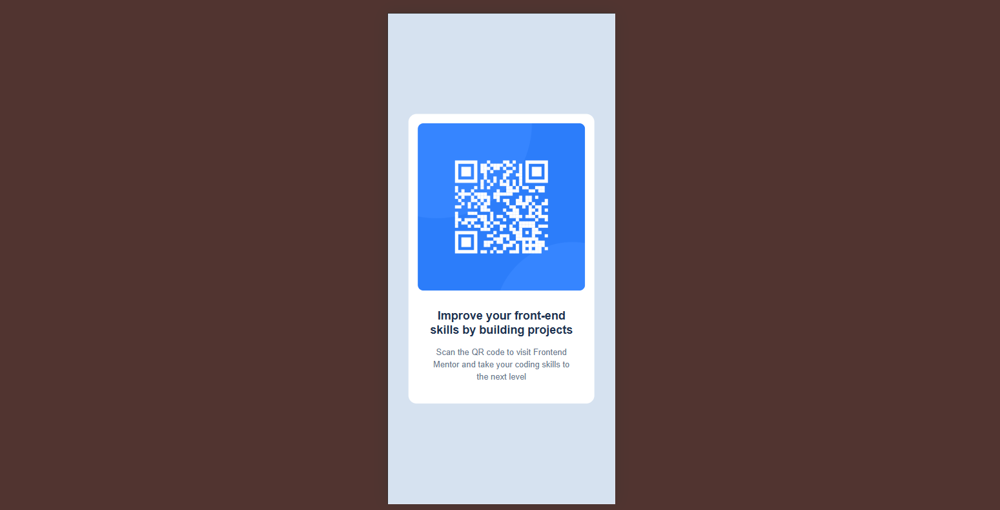

# Frontend Mentor - QR code component solution

This is a solution to the [QR code component challenge on Frontend Mentor](https://www.frontendmentor.io/challenges/qr-code-component-iux_sIO_H). Frontend Mentor challenges help to improve coding skills by building realistic projects.

## Table of contents

- [Overview](#overview)
  - [Screenshot](#screenshot)
  - [Links](#links)
- [My process](#my-process)
  - [Built with](#built-with)
  - [What I learned](#what-i-learned)
  - [Useful resources](#useful-resources)
- [Author](#author)

## Overview

This is a simple QR code card component built using HTML and CSS. It is fully responsive and styled to match the design provided by Frontend Mentor. The goal of this challenge was to practice layout, spacing, alignment, and responsive design.

### Screenshot

### Links

- Solution URL: [View on Frontend Mentor](https://www.frontendmentor.io/solutions/responsive-qr-code-component-using-flex-box-hLeogmfeEY)
- Live Site URL: [Live Demo](https://madiharehman-web.github.io/qr-code-component/)

## My process

### Built with

- Semantic HTML5 markup
- Vanilla CSS (no frameworks)
- Flexbox
- Mobile-first workflow

### What I learned

While building this QR code component, I learned several important frontend development concepts:

- How to create a mobile-first layout using CSS.
- The difference between semantic and non-semantic HTML elements.
- How to use Flexbox to center items both vertically and horizontally.
- How to structure and link an external CSS file with an HTML document.

Here are a few code snippets I’m proud of:

HTML:

<section class="qr-code-container">
  
</section>

CSS:
.qr-code-container {
background-color: white;
padding: 1rem;
border-radius: 1rem;
display: flex;
flex-direction: column;
align-items: center;
}

### Useful resources

- **Frontend Mentor** – This helped me understand how to approach real-world frontend challenges. I really liked the way they structure their challenges and will continue using it going forward.
- **MDN Web Docs** – This is an amazing resource which helped me understand various HTML, CSS, and JavaScript concepts in depth. I’d recommend it to anyone still learning frontend development.

## Author

- Name – **Madiha Rehman**
- Frontend Mentor – [@MadihaRehman-web](https://www.frontendmentor.io/profile/MadihaRehman-web)
- Twitter – **Not available**
